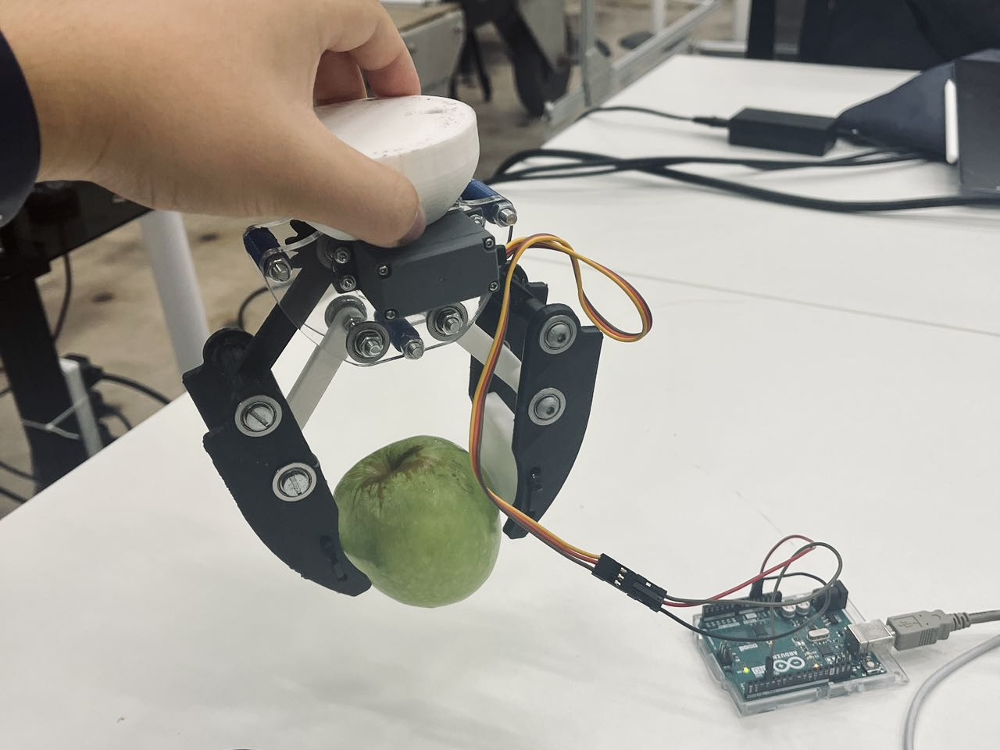
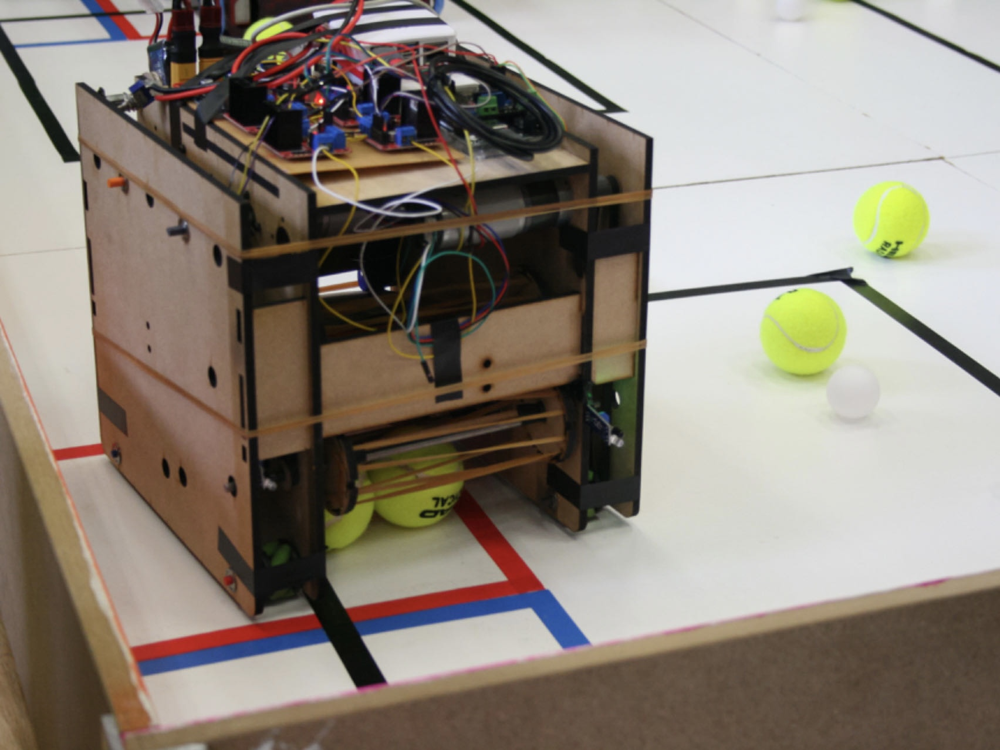
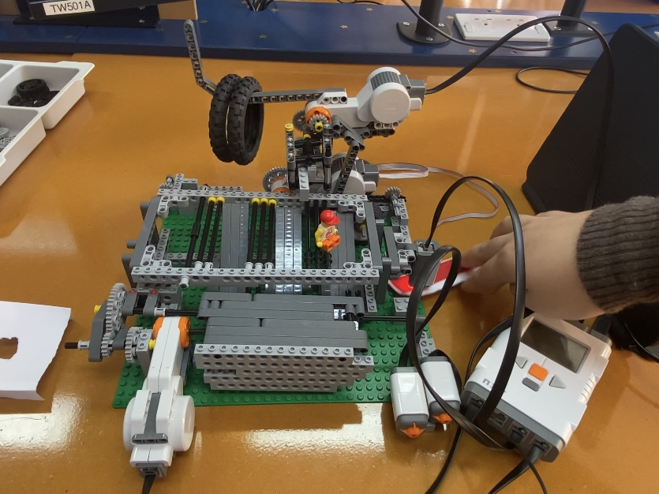
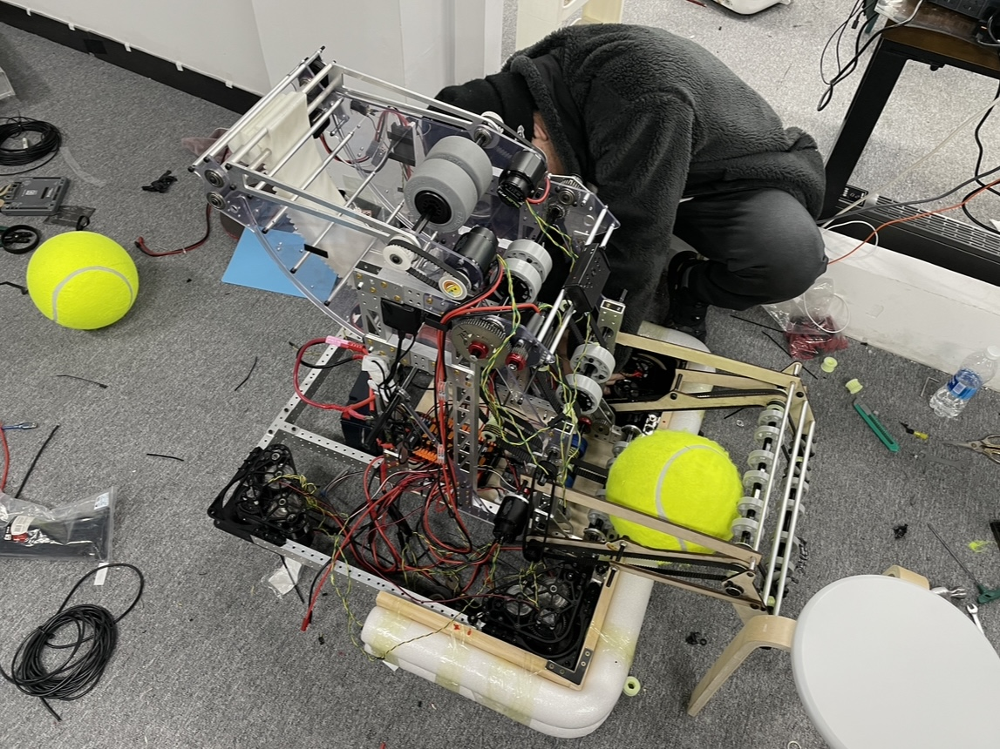
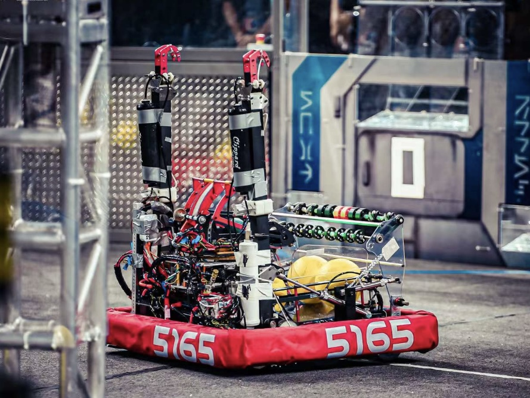

## About Me
I am an undergraduate student at the University of Cambridge, interested in the field of <strong>robotics engineering</strong>, with expertise in mechanical design, software implementation, and a deep understanding of machine learning. I served as the Chief Mechanical Designer for my high school's FIRST Robotics Team, where I led diverse mechanical design projects and oversaw the development, testing, and validation of control algorithms. Currently, I am an undergraduate researcher at the University of Cambridge's <strong>Bio-Inspired Robotics Lab</strong>.

Beyond my formal experiences, I am passionate about applying machine learning to enhance intelligent robotics systems, particularly by optimizing sensor feedback readings and bridging the gap between mechanics and electrical systems.

## Skills
- **Programming Languages**: Proficient in Python, C++, Java (familiar with git for version control), LaTeX; Intermediate in HTML
- **Programming Concepts**: Proficient in Embedded Systems (Familiar with I2C, CAN, UART), Object-Oriented Programming; Familiar with Applications with Convolutional Neural Network (CNN) and Recurrent Neural Network (RNN)
- **Operating Systems & Tools**: Intermediate in CentOS, Ubuntu, ROS; Intermediate Cloud-computing
- **Design**: Proficient in Solidworks, Autodesk Fusion 360, Autodesk Inventor
- **Manufacturing Techniques**: Proficient in 3D Printing, Laser Cutting; Proficient in Design, Rapid-Prototyping, Verification

## Research Interests

- **Robotics Design:** Robotics Cooking, Object Manipulation, End Effector Design
- **Machine Learning:** Tool Pose Estimation, Trajectory Optimisation
- **Automation:** Autonomous Robotic Systems, Path Planning with Multi-Sensor Input

<!-- ## Publications

Coming soon... -->

<!-- - **Mnemonics Training: Multi-Class Incremental Learning without Forgetting**
   
  **Yaoyao Liu**, Yuting Su, An-An Liu, Bernt Schiele, Qianru Sun
   
  IEEE Conference on Computer Vision and Pattern Recognition. **CVPR 2020**.
   
  [[PDF](https://arxiv.org/pdf/2002.10211.pdf)] [[Code](https://github.com/yaoyao-liu/mnemonics)] <strong><i style="color:#e74d3c">Oral Presentation</i></strong>
 -->

## Project Experiences

<html lang="en">
<head>
    <meta charset="UTF-8">
    <meta name="viewport" content="width=device-width, initial-scale=1.0">
    <link rel="stylesheet" type="text/css" href="styles.css">
    <title>Text and Picture with Border</title>
</head>
<body>
    

        

            <h3>Robotics Manipulator Design</h3>
            
I developed an affordable and user-friendly 3D-printed PLA gripper for robotic arms, capable of handling a wide range of objects, from soft to hard, using a standard-sized servo and Arduino UNO R3 for power and control. 

        

        

            
        

    

</body>
</html>
 

<html lang="en">
<head>
    <meta charset="UTF-8">
    <meta name="viewport" content="width=device-width, initial-scale=1.0">
    <link rel="stylesheet" type="text/css" href="styles.css">
    <title>Text and Picture with Border</title>
</head>
<body>
    

        

            <h3>Unibots Robotics Competition</h3>
            
I served as the lead mechanical designer for the Unibots project, specializing in ball intake and maneuvering mechanisms. Additionally, I oversaw the robot's characterization and localization design and implementation. 

        

        

            
        

    

</body>
</html>
 

<html lang="en">
<head>
    <meta charset="UTF-8">
    <meta name="viewport" content="width=device-width, initial-scale=1.0">
    <link rel="stylesheet" type="text/css" href="styles.css">
    <title>Text and Picture with Border</title>
</head>
<body>
    

        

            <h3>Vending Machine Lego Project</h3>
            
In collaboration with my team, we created a prototype vending machine for demonstration purposes. My contribution involved utilizing an infrared sensor to illuminate and detect the reflective light wavelengths, allowing us to identify coupons of varying colors.

        

        

            
        

    

</body>
</html>
 

<html lang="en">
<head>
    <meta charset="UTF-8">
    <meta name="viewport" content="width=device-width, initial-scale=1.0">
    <link rel="stylesheet" type="text/css" href="styles.css">
    <title>Text and Picture with Border</title>
</head>
<body>
    

        

            <h3>FIRST Robotics Competition 2022</h3>
            
In collaboration with the mechanical design team, I integrated swerve modules into the chassis, designed telescoping arms for the climbing structure, incorporated a pneumatic multi-speed gearbox, and created an adjustable hooded shooter. We also employed vision and point cloud cameras for localization and auto-aiming capabilities.

        

        

            
        

    

</body>
</html>
 

<html lang="en">
<head>
    <meta charset="UTF-8">
    <meta name="viewport" content="width=device-width, initial-scale=1.0">
    <link rel="stylesheet" type="text/css" href="styles.css">
    <title>Text and Picture with Border</title>
</head>
<body>
    

        

            <h3>FIRST Robotics Competition 2021</h3>
            
As the sole robot designer, I employed a conventional pneumatic switchable multi-speed gearbox for the tank drive chassis. I also implemented a serial design to align balls, enhancing shooting speed. Additionally, a vision camera was integrated to estimate the target's distance and direction, automatically adjusting the shooting speed and hooded shooter angle.

        

        

            
        

    

</body>
</html>
 

## Research Experiences
- Undergraduate Researcher, Bio-Inspired Robotics Lab@Cambridge, Jun 2023 - Present.

## Educational Background
- BA(Hons) and MEng in Engineering, University of Cambridge, Oct 2022 - Present.